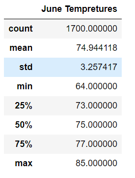
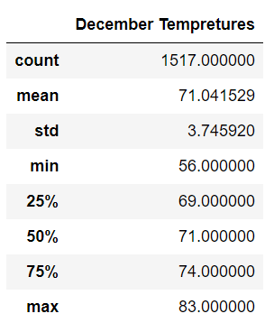

# Surfs_up
A project with SQLAlchemy, Flask and Jupyter Notebook

You can find the analysis file here: [Surfs_up_challenge](https://github.com/NedaAJ/Surfs_up/blob/main/SurfsUp_Challenge.ipynb)

## Contact:
- Email : [neda.ahmadi.jesh@gmail.com](mailto:neda.ahmadi.jesh@gmail.com?subject=[GitHub]%20Source%20Han%20Sans)
- Linkedin: www.linkedin.com/in/neda-ahmadi-j
